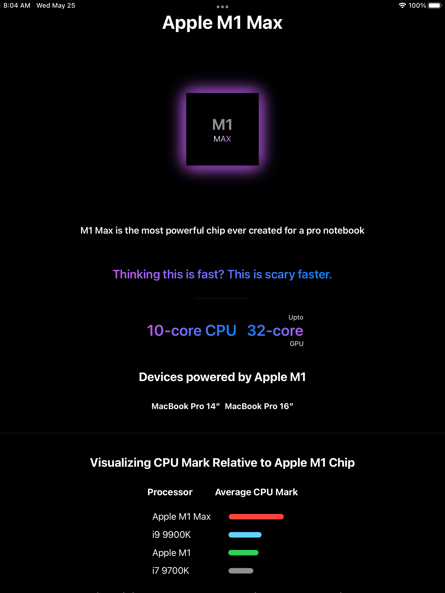
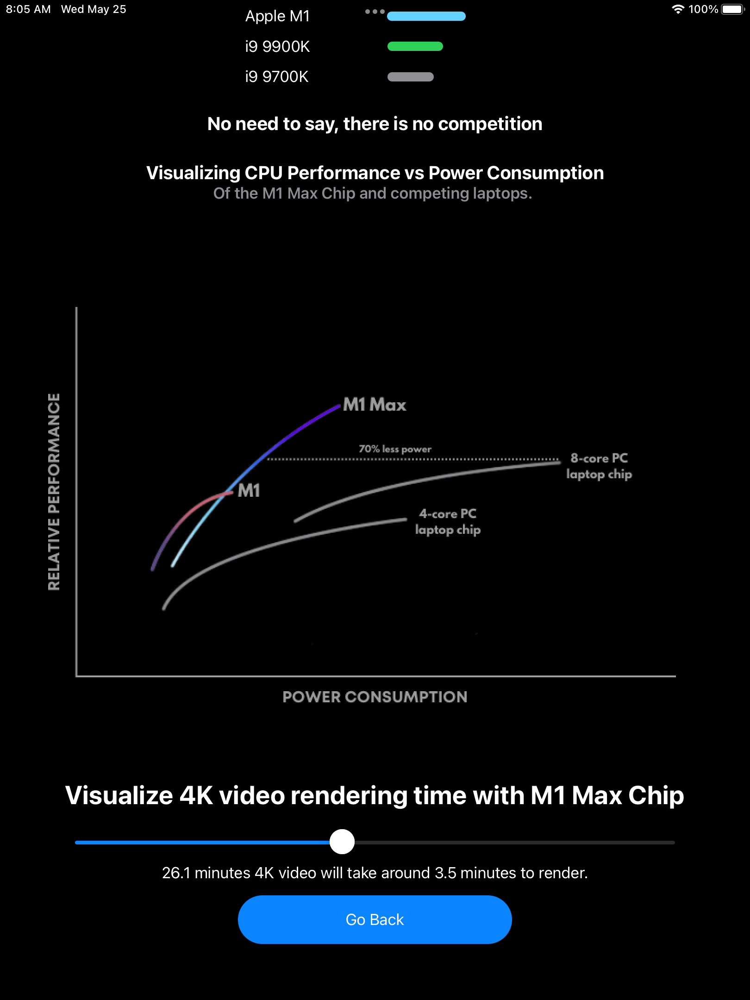
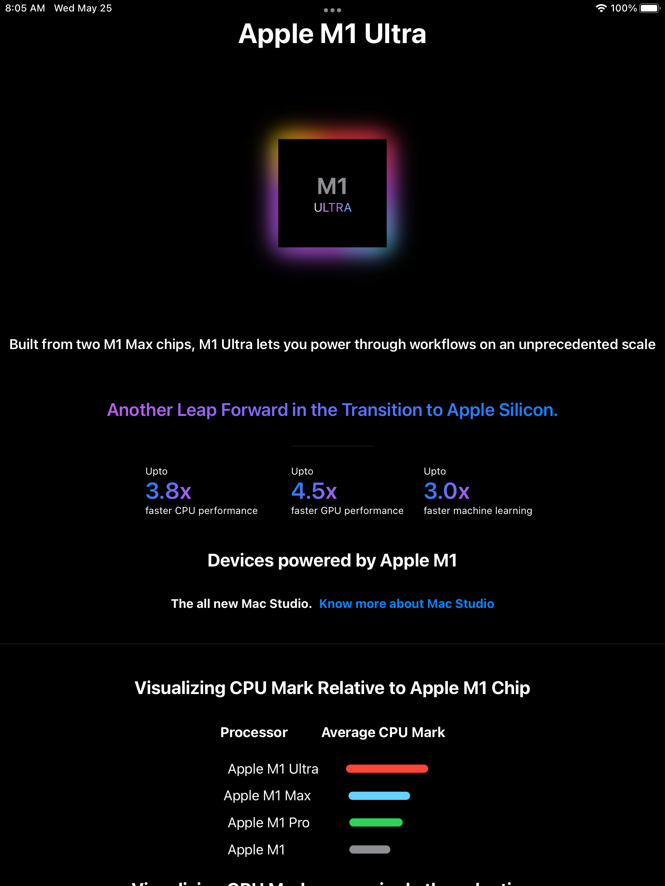
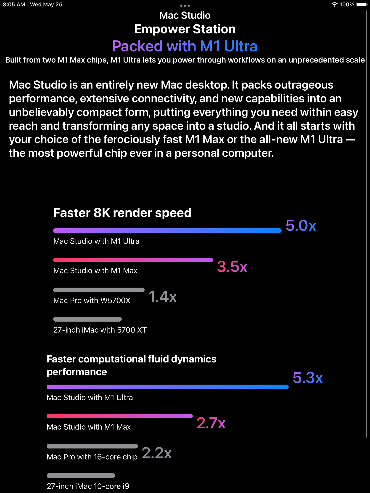

# Chipify - Swift Playground: WWDC22
Repository for my WWDC 2022 Swift Student Challenge submission (accepted).

 

## About this Playground
This is a playground built with Swift & SwiftUI that gives a walkthrough of the powerful M Series Chips by Apple.

The user can explore the capabilites, specifications, comparisons with competitors and graphical visualizations of the M1 Chips: M1, M1 Pro, M1 Max, M1 Ultra.

There is also an easter-egg in the playground to explore the newly launched Mac Studio.

 

## Screenshots
 
 
 
 

 

 ## Video Walkthrough

 A short glimpse of the playground can be seen on YouTube by clicking [here.](https://www.youtube.com/shorts/bWf6gNBQSB8)
